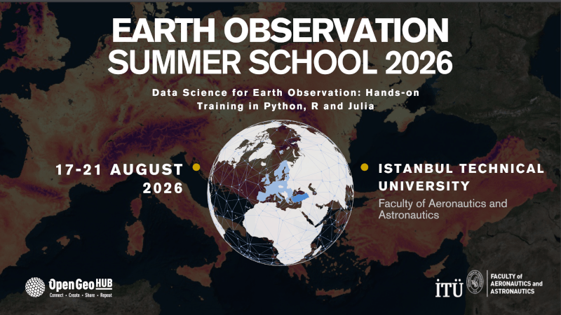

# Earth Observation Summer School 2026

**The OpenGeoHub Summer School series, https://opengeohub.org/2026/01/29/earth-observation-summer-school-2026/**

**17–21 August 2026, Istanbul, Turkey**

## 17 August 2026

<!-- ### Plenary introduction, including introduction to the hackathons -->

<!-- ### Kaan Kalkan: "Fundamentals of Satellite Image Quality and Interpretation" -->

### Jakub Nowosad: "Building reproducible spatial workflows in R"

- [Materials](https://jakubnowosad.com/ogh2026/docs/workflows.html)

### Mustafa Serkan Isik: "Crash Course on SpatioTemporal Asset Catalogs (STAC) and Cloud-Optimized Geospatial Data Access"

- [Materials](https://docs.google.com/presentation/d/1ETf8cLVETu1e6VUZOHhjAsBeJR92xoYdNGGV10b15ak/edit?slide=id.gd9c453428_0_16#slide=id.gd9c453428_0_16)

## 18 August 2026

<!-- ### Kaan Kalkan: "Türkiye’s Remote Sensing Ecosystem: Capabilities, Infrastructure and Future Vision" -->

### Serkan Girgin: "Monitoring and Benchmarking Geospatial Workflows for Efficient and Reproducible Earth Observation"

- [Materials](https://zenodo.org/records/21995899)

### Daniel Loos: "Introduction to Julia"

- [Materials](https://docs.google.com/document/d/15w3Z52qXkwEitjzl_SY5etWYGDz2YGjr6QgDUFFWC8w/edit?tab=t.0#heading=h.7loe94cm3i09)

### Krzysztof Dyba: "Flood detection using satellite data"

- [Materials](https://github.com/kadyb/ogh2026)

<!-- ### Ondrej Pesek: "GRASS as a GIS" -->

<!-- ### Esra Erten: "Seeing the Earth in Microwaves: SAR Physics, Operational Missions, and the Road Ahead" -->

## 19 August 2026

### Leandro Parente: "Scaling High-Resolution Grassland Insights: Delivering 10 m Daily Productivity Data in Near-Real-Time using Sentinel-2"

- [Materials](https://docs.google.com/presentation/d/1UFMK_nJcgkpRi4z_maPX2wJ1Ljkowe4P-rtaDkzvVIo/edit?slide=id.g3be396cf5e6_0_5#slide=id.g3be396cf5e6_0_5)

### Jakub Nowosad: "Where can your spatial model be trusted? Reliable validation of spatial machine learning"

- [Materials](https://jakubnowosad.com/ogh2026/docs/validation.html)

<!-- ### Daniel Loos: "Data Cubes in Julia"

- [Materials]() -->

<!-- ### Adam Stewart: "Introduction to TorchGeo: Deep learning with geospatial data" -->

### Mateo Moreno: "Mining existing land cover products for ensemble classification"

- [Materials](https://docs.google.com/presentation/d/1-_9uACRhhxIOeZaS1CmM0bjWjjeOGrZsV9SGpXAhqPI/edit?slide=id.gd9c453428_0_16#slide=id.gd9c453428_0_16) and [Materials](https://github.com/mmorenoz/elc-ogh-summer-school-2026)

### Tom Hengl (OpenGeoHub): "Time-series analysis using R terra packages"

- [Materials](https://docs.google.com/presentation/d/1n910IROd6jxmjoJFa-gYCt2YxWPSURRcHTUn1-Jzm4o/edit?slide=id.g3f73e7273ac_0_186#slide=id.g3f73e7273ac_0_186)

### Yu-Feng Ho: "Machine Learning Models with Uncertainty Quantification"

- [Materials](https://codeberg.org/yu-feng-ho/OGH26)

## 20 August 2026

<!-- ### Andrés Zlinszky: "A new hope: Breaking the barriers of earth observation with open data, open processing capacity, open code and AI" -->

<!-- ### Adam Stewart: "All models are NOT created equal: Evaluation of model performance" -->

<!-- ### Leandro Parente: "Boosting your geocomputation workflow using Pi coding agent" -->

<!-- ### Jakub Nowosad: "Spatial visualization with tmap" -->

<!-- ### Serkan Girgin: "Benchmarking Geospatial Workflows with Geobench: A Hands-on Tutorial" -->

<!-- ### Krzysztof Dyba: "Analysis of land surface temperature based on thermal satellite data" -->

## 21 August 2026

<!-- ### Adam Stewart: "Preprocessing with GDAL: A gentle introduction to the command line" -->

<!-- ### Andrés Zlinszky: "Open satellite imagery and environmental datasets in Copernicus Browser" -->

<!-- ### Pratichhya Sharma: "Pixels to Patterns: ML Data Preparation using openEO in Copernicus Data Space Ecosystem" -->

<!-- ### Mehmet Furkan Celik: "Deep Learning Guided Crop Boundary Delineation from Multimodal Satellite Images" -->

<!-- ### Yu-Feng Ho: "Derive and Apply Multiscale Terrain Variables in Environmental Research" -->

<!-- ### Andrés Zlinszky: "How to become an EO coder using AI: Sentinel Hub custom scripts and CDSE Jupyter Lab" -->

<!-- ### 3mins pitchs, closing remarks and announcement of hackathon winners -->
